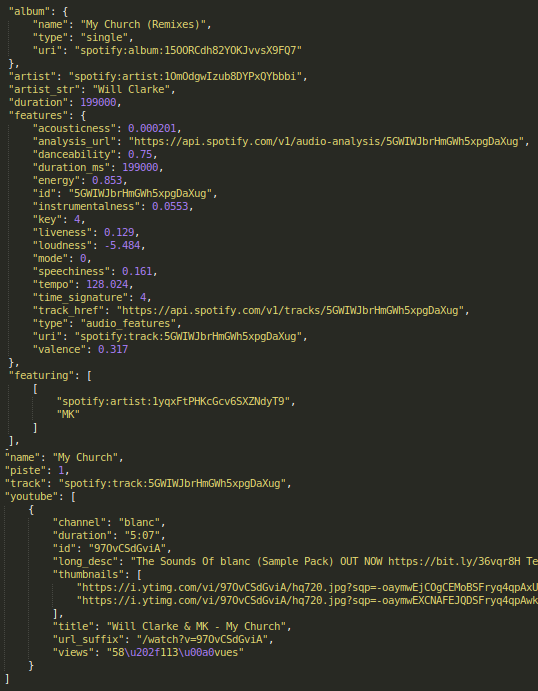

# Overview

Repository du bac à sable music. Développement de plusieurs applications liées à la musique éléctronique.

# Environnement Python

Afin d'utiliser les applications, on doit installer l'environnement adéquat. Pour ce faire, utilisez conda avec les commandes suivantes :
```
git clone https://github.com/hansglick/music_playground.git
conda env create -f environment.yml
conda activate music
```

# Applications

### **Extraction des tracks d'un artiste**

L'application [grabber.py](https://github.com/hansglick/music_playground/blob/master/app_grab_tracks/grabber.py) permet d'extraire l'ensemble des tracks d'un artiste sous la forme d'un json ([notebook](https://github.com/hansglick/music_playground/blob/master/app_grab_tracks/grabber.ipynb)). Comme, l'illustre l'image c-dessous, les informations récupérées sont très divers : *nom*, *date*, *album/compil*, *features audio*, etc. Les arguments de l'application sont les suivants : 
 * **-a** : le nom de l'artiste
 * **-f** : le nom du json qui contiendra les résultats, i.e. la discographie de l'artiste

```
conda activate music
(music) python app_grab_tracks/grabber.py -a james ruskin -f app_grab_tracks/james_ruskin_tracks.json
```




